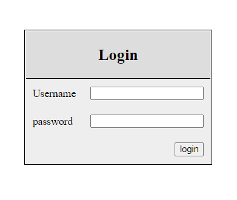

# Sistem Login

Proyek ini adalah halaman login sederhana yang memungkinkan pengguna untuk masuk ke sistem.

## Deskripsi

Halaman `login.php` menyediakan antarmuka untuk pengguna memasukkan nama pengguna dan kata sandi mereka. Setelah berhasil login, pengguna akan diarahkan ke halaman utama sistem.

## Fitur

- **Formulir Login**: Memungkinkan pengguna untuk memasukkan nama pengguna dan kata sandi.
- **Validasi Input**: Memastikan bahwa input pengguna valid sebelum mengakses sistem.
- **Keamanan**: Mengimplementasikan praktik terbaik untuk keamanan data pengguna.
